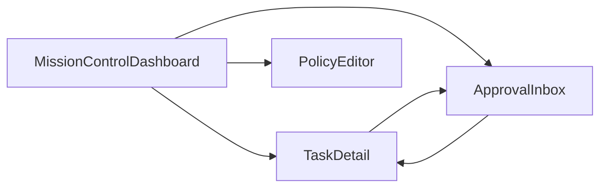

# Wireframes

These are low-fidelity wireframes for the core MVP surfaces. They are optimized for the first user persona, the `tech lead`, and the first workflow, which is delegating a scoped ticket to an AI agent and reviewing the result before merge.

## Screen 1: Mission Control Dashboard

### Purpose
Give the tech lead one live view of all active and recent AI work across repositories.

```text
+--------------------------------------------------------------------------------------------------+
| AI Control Pane                                            Team: Product Eng   Time Range: 24h   |
+--------------------------------------------------------------------------------------------------+
| Search tasks...         Repo v         Status v         Owner v         Risk v         New Task  |
+--------------------------------------------------------------------------------------------------+
| KPIs                                                                                             |
| Active Runs: 12   Waiting Approval: 4   Blocked: 3   Merged Today: 9   Avg Review Time: 18 min  |
+--------------------------------------------------------------------------------------------------+
| Active / Recent Runs                                                                              |
|--------------------------------------------------------------------------------------------------|
| Status   Risk   Task / Ticket             Repo            Agent        Owner      Runtime  Action |
| Running  Med    ACP-142 Settings UI       web-app         impl-agent   Maya       08:14    View   |
| Review   Low    ACP-155 API validation    api-service     impl-agent   Jordan     14:02    Review |
| Blocked  High   ACP-161 OAuth callback    auth-service    test-agent   Priya      05:50    Triage |
| Retry    Med    ACP-149 CI failure fix    shared-ui       ci-agent     Sam        19:31    Resume |
| Merged   Low    ACP-133 docs update       docs            doc-agent    Alex       04:07    Audit  |
+--------------------------------------------------------------------------------------------------+
| Right Rail                                                                                        |
|--------------------------------------------------------------------------------------------------|
| Blocked reasons                                                                                   |
| - Missing test environment secret                                                                 |
| - Policy denied production command                                                                |
| - Failing integration test                                                                        |
|                                                                                                   |
| Suggested actions                                                                                 |
| - Re-scope ACP-161 to staging only                                                                |
| - Review approval queue                                                                           |
+--------------------------------------------------------------------------------------------------+
```

### Key Behaviors
- Quick filtering by status, repo, owner, and risk.
- Single-click actions into review, triage, and audit trails.
- The most important operational states stay above the fold: running, review, blocked.

## Screen 2: Task Detail

### Purpose
Show the full lifecycle of a single agent run, including context, live progress, evidence, and human decisions.

```text
+--------------------------------------------------------------------------------------------------+
| Task: ACP-142 Settings UI                                    Status: Review Ready   Risk: Medium |
| Repo: web-app   Branch: ai/acp-142-settings-ui   Owner: Maya   Agent: impl-agent   Cost: $3.42 |
+--------------------------------------------------------------------------------------------------+
| Summary                                                                                           |
| Build settings page for model routing and budget alerts. Acceptance criteria attached from issue.|
+--------------------------------------------------------------------------------------------------+
| Left Column                                  | Center Column                  | Right Column      |
|----------------------------------------------|--------------------------------|-------------------|
| Context                                      | Run Timeline                   | Decision Panel    |
| - Linked ticket                              | 09:10 Task created             | Approve           |
| - Repo memory                                | 09:12 Plan generated           | Request retry     |
| - Attached docs                              | 09:16 Files edited             | Re-scope          |
| - Applied policy pack                        | 09:22 Tests passed             | Escalate human    |
|                                              | 09:24 Review package ready     |                   |
|----------------------------------------------|--------------------------------|-------------------|
| Evidence Tabs                                | Diff Preview                   | Reviewer Notes    |
| [Diff] [Tests] [Commands] [Rationale]        | + settings route               |                   |
|                                              | + budget threshold form        |                   |
|                                              | + validation tests             |                   |
|                                              | - old placeholder page         |                   |
|----------------------------------------------|--------------------------------|-------------------|
| Blockers / Risks                             | Agent Notes                    | Audit             |
| - None                                       | Added server validation to     | Requested by Maya |
| - Uses existing auth middleware              | prevent invalid provider saves | Policy v3.1       |
+--------------------------------------------------------------------------------------------------+
```

### Key Behaviors
- One page should answer what happened, what changed, what passed, and what to do next.
- Evidence tabs let the reviewer move from summary to proof without leaving context.
- Decision actions remain visible while scrolling.

## Screen 3: Approval Inbox

### Purpose
Help a tech lead review multiple runs efficiently and make consistent decisions.

```text
+--------------------------------------------------------------------------------------------------+
| Approval Inbox                                              Queue: 7 items     SLA Risk: 2 high  |
+--------------------------------------------------------------------------------------------------+
| Filters: Repo v   Risk v   Outcome Needed v   Reviewer v                               Bulk Skip |
+--------------------------------------------------------------------------------------------------+
| Queue List                                 | Selected Item                                            |
|--------------------------------------------|----------------------------------------------------------|
| > ACP-155 API validation                   | Header                                                   |
|   Repo: api-service                        | ACP-155 API validation                                   |
|   Waiting: 18 min   Risk: Low              | Repo: api-service   Agent: impl-agent   Runtime: 14 min  |
|--------------------------------------------|----------------------------------------------------------|
|   ACP-161 OAuth callback                   | Change Summary                                           |
|   Repo: auth-service                       | - Tightened request validation                           |
|   Waiting: 11 min   Risk: High             | - Added callback error state                             |
|--------------------------------------------| - Updated 3 tests                                        |
|   ACP-149 CI failure fix                   |                                                          |
|   Repo: shared-ui                          | Evidence Snapshot                                        |
|   Waiting: 09 min   Risk: Medium           | Tests: 18 passed   0 failed                              |
|--------------------------------------------| Commands: 7 allowed   0 denied                           |
|                                            | Files touched: 4                                         |
|                                            |                                                          |
|                                            | Reviewer Actions                                         |
|                                            | [Approve] [Retry with note] [Escalate] [Open full task]  |
+--------------------------------------------------------------------------------------------------+
```

### Key Behaviors
- Fast triage for low-risk runs.
- Easy escalation path for high-risk or ambiguous runs.
- Reviewers can approve from the queue or dive deeper into the task detail page.

## Screen 4: Policy Editor

### Purpose
Let the team define what agents can access and what requires approval.

```text
+--------------------------------------------------------------------------------------------------+
| Policy Editor                                       Scope: web-app / default engineering policy   |
+--------------------------------------------------------------------------------------------------+
| Tabs: [Permissions] [Approval Gates] [Budgets] [Memory Sources] [Audit History]                 |
+--------------------------------------------------------------------------------------------------+
| Permissions                               | Current Rules                                           |
|-------------------------------------------|---------------------------------------------------------|
| File access                               | Allow: src/**, tests/**, docs/**                        |
| [x] Read all repo files                   | Deny: .env*, secrets/**, infra/prod/**                 |
| [x] Edit allowed paths only               |                                                         |
|                                           | Command policy                                          |
| Command access                            | Allow: npm test, npm run lint, npm run build           |
| [x] Allow safe test commands              | Deny: deploy, terraform apply, kubectl delete          |
| [x] Require approval for git push         |                                                         |
| [x] Deny production-impacting commands    | Approval gates                                          |
|                                           | - High-risk file changes                                |
| Runtime budgets                           | - New dependency installation                           |
| Max run time: [45 min____]                | - Failed tests with skipped retry                       |
| Max spend:    [$10_______]                |                                                         |
| Max retries:  [2________]                 | Save Draft   Publish Policy                             |
+--------------------------------------------------------------------------------------------------+
```

### Key Behaviors
- Policies should be understandable by engineering leaders, not only platform specialists.
- Every risky permission should map to a visible approval gate.
- Policy changes need audit history because trust depends on traceability.

## Navigation Model



## Information Hierarchy
- `Dashboard`: what is happening right now
- `Task detail`: what happened in this run
- `Approval inbox`: what needs a decision
- `Policy editor`: what agents are allowed to do

## MVP Interaction Notes
- The first release should favor clarity over density.
- Every screen should expose status, risk, and next action prominently.
- The reviewer should never need to leave the product to understand why an agent is asking for approval.
